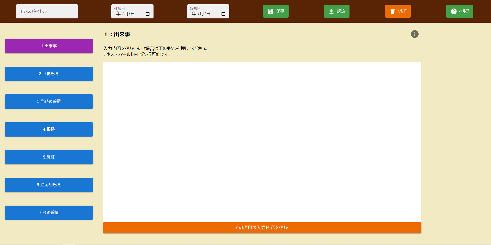
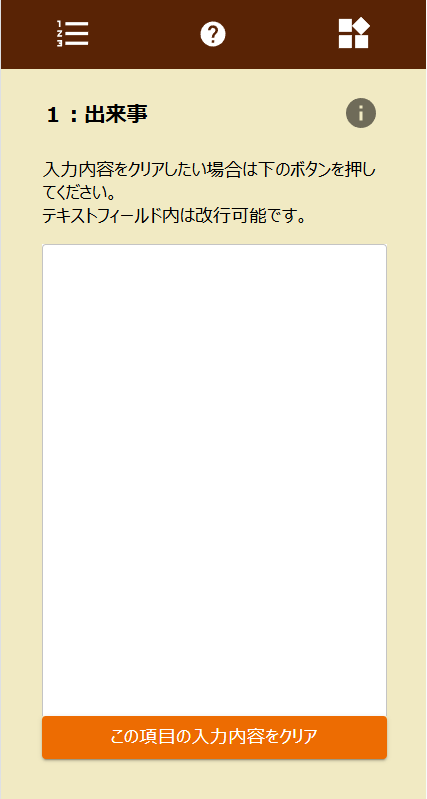

# CBT-app
認知行動療法のコラム表をアプリ化したものです。

## デモ
960px以上/未満がブレークポイントとなっています。

<Image 2> スマホ版の場合、画面構成をコンパクトにするため入力・機能エリアをハンバーガーメニューとしています。

## 技術スタック
React, vite, MUI, PHP, MySQL

## 特徴
- MUIを活用して見やすさ、使いやすさを意識。
- PHP、MySQLを利用した保存・読込・削除機能を実装。
- 読込画面に出力機能（jsonファイル）があり、カウンセラーやAI等と共有可能。
- 当時/現在の感情入力時、別画面で感情名を選択することで入力画面に反映可能。

## ディレクトリ構成(srcディレクトリ以下)
src
├─components                # UI部品（画面上部：header, 画面下部：workspace）
│  ├─header
│  │  ├─hamburger-menu      # レスポンシブデザイン向け部品
│  │  ├─header-function     # 保存、読込などの諸機能
│  │  └─header-input        # コラム表のタイトル、作成日などの共通項目入力欄
│  └─workspace
│      ├─side-bar           # コラム表の各欄を表示する
│      └─writing-area       # テキストの入力エリア
│          └─single-help    # 各項目に表示するための個別ヘルプ
├─context                   # Global state (HeaderProvider / WorkSpaceProvider)
├─App.jsx
└─main.jsx

### 作成経緯
自身もカウンセリングでコラム表を作成することがありましたが、紙に手書きで作成していました。
後日の振り返り、あるいは出来事に遭遇したタイミングで書きたいと感じたことがあり、アプリ化しました。